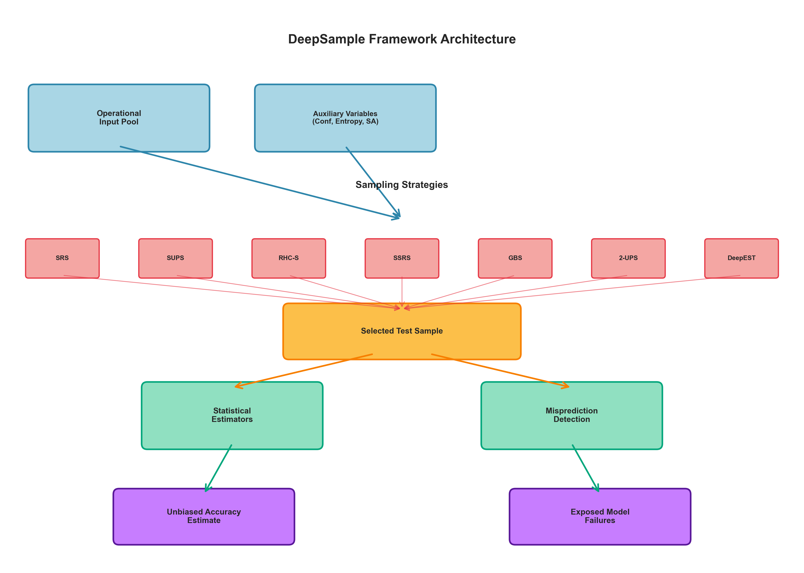
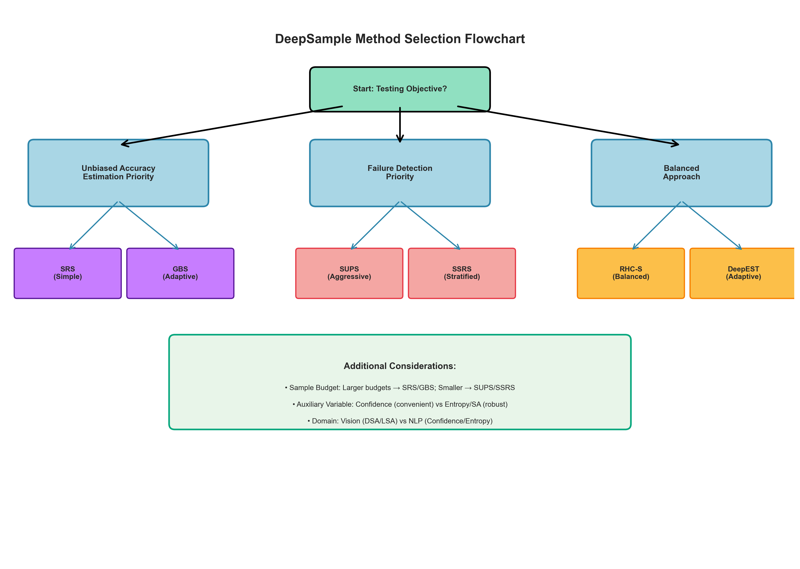

# Chapter 3: The DeepSample Framework

## 3.1 Framework Overview

DeepSample treats DNN/LLM evaluation as a **probabilistic operational testing** problem. Given an operational input pool D of size N and a trained model M, the goal is to estimate M's expected accuracy μ on D using a small labeled sample S ⊂ D of size n << N, while simultaneously exposing mispredictions for model improvement.

### 3.1.1 Problem Formulation

**Input**: 
- Operational dataset D = {x₁, x₂, ..., x_N}
- Trained model M with prediction function f_M: X → Y
- Labeling budget n << N

**Output**:
- Unbiased accuracy estimate μ̂ with confidence interval [μ̂ - ε, μ̂ + ε]
- Set of detected mispredictions F ⊂ S

**Objectives**:
1. Minimize estimation error: E[(μ̂ - μ)²]
2. Maximize failure detection: |F|
3. Minimize labeling cost: n

### 3.1.2 Auxiliary Variables

DeepSample leverages **auxiliary variables** z_i that correlate with error probability to guide sampling. For input x_i:

**Confidence Score**: c_i = max_y P(y|x_i, M) - the maximum predicted class probability

**Prediction Entropy**: H_i = -Σ P(y|x_i, M) log P(y|x_i, M) - uncertainty over output distribution

**Surprise Adequacy**:
- **DSA** (Distance-based): d_i = min_j ||a(x_i) - a(x_j)||₂ where a(·) are layer activations and x_j ∈ D_train
- **LSA** (Likelihood-based): l_i = -log p(a(x_i) | D_train) under Gaussian KDE

**Key Insight**: Inputs with low confidence, high entropy, or high surprise are more likely to be mispredicted, making them valuable for both estimation efficiency and failure detection.

## 3.2 Sampling Strategies



### 3.2.1 Simple Random Sampling (SRS)

**Description**: Each input has equal selection probability π_i = n/N.

**Algorithm**:
```
1. Randomly select n inputs from D without replacement
2. Label selected inputs
3. Estimate accuracy: μ̂_SRS = (1/n) Σ I(f_M(x_i) = y_i)
```

**Estimator**: Standard sample mean with variance V(μ̂_SRS) = (1-n/N) × σ²/n

**Advantages**: 
- Simplest method, no auxiliary variables needed
- Unbiased, well-understood statistical properties
- Robust across different data distributions

**Disadvantages**:
- Doesn't prioritize difficult cases
- May require larger n for same precision as adaptive methods
- Lower failure detection rate

**Use Cases**: Baseline comparison, large budgets, unknown auxiliary variable quality

### 3.2.2 Simple Unequal Probability Sampling (SUPS)

**Description**: Selection probability proportional to auxiliary variable (probability-proportional-to-size sampling).

**Algorithm**:
```
1. Compute auxiliary variable z_i for all inputs (e.g., z_i = 1/c_i)
2. Set π_i = n × z_i / Σz_j
3. Sample n inputs with replacement according to π_i
4. Label and apply Horvitz-Thompson estimator
```

**Estimator**: μ̂_SUPS = (1/n) Σ I(f_M(x_i) = y_i) / π_i

**Advantages**:
- Aggressively targets low-confidence inputs
- Highest failure detection rate
- Effective with small budgets

**Disadvantages**:
- Higher estimation variance due to unequal weights
- Sensitive to auxiliary variable quality
- May oversample outliers

**Use Cases**: Safety-critical testing, bug-finding priority, preliminary model debugging

### 3.2.3 RHC-Sampling (RHC-S)

**Description**: Rao-Hartley-Cochran unequal probability sampling without replacement.

**Algorithm**:
```
1. Partition D into n groups G₁, ..., G_n
2. Within each group, select one input with probability ∝ z_i
3. Label selected inputs
4. Apply RHC estimator with pairwise inclusion probabilities
```

**Estimator**: μ̂_RHC = Σ w_i × I(f_M(x_i) = y_i) where weights account for within-group selection

**Advantages**:
- Balances targeted sampling with coverage
- No duplicate selections (without replacement)
- Lower variance than SUPS for same auxiliary

**Disadvantages**:
- More complex implementation
- Requires careful partitioning strategy
- Sensitive to partition quality

**Use Cases**: Moderate budgets, when diversity and targeting both matter

### 3.2.4 Stratified Simple Random Sampling (SSRS)

**Description**: Partition D into strata based on auxiliary variable ranges, sample within each stratum.

**Algorithm**:
```
1. Create K strata based on auxiliary variable quantiles
2. Allocate sample sizes n_k using Neyman allocation: n_k ∝ N_k × σ_k
3. Randomly sample n_k inputs from stratum k
4. Combine estimates: μ̂_SSRS = Σ (N_k/N) × μ̂_k
```

**Estimator**: Weighted average of stratum-specific means

**Variance**: V(μ̂_SSRS) = Σ (N_k/N)² × (1-n_k/N_k) × σ_k²/n_k

**Advantages**:
- Systematic coverage of input space
- Reduces variance through stratification
- Excellent failure detection across all difficulty levels

**Disadvantages**:
- Requires choosing number of strata K
- Initial estimates may have high error with small n
- Performance improves slowly with budget

**Use Cases**: Comprehensive testing, ensuring coverage of all input types

### 3.2.5 Gradient-Based Sampling (GBS)

**Description**: Adaptive stratified sampling that iteratively selects strata to minimize estimation variance.

**Algorithm**:
```
1. Initialize with small sample from each stratum
2. Repeat until budget exhausted:
   a. Estimate variance contribution of each stratum
   b. Select next sample from stratum with highest variance gradient
   c. Update estimates
3. Compute final weighted estimate
```

**Estimator**: Adaptive weighted combination with variance-minimizing allocation

**Advantages**:
- Dynamically adapts to observed data
- Minimizes estimation error through variance reduction
- Balances exploration and exploitation

**Disadvantages**:
- Requires sequential sampling (can't parallelize)
- More complex implementation
- Needs sufficient initial samples per stratum

**Use Cases**: Accuracy estimation priority, iterative testing workflows

### 3.2.6 Two-stage Unequal Probability Sampling (2-UPS)

**Description**: Hierarchical sampling—first select partition, then sample within partition.

**Algorithm**:
```
1. Partition D into K groups based on auxiliary variable
2. Stage 1: Select group k with probability ∝ group size × avg(z_i)
3. Stage 2: Randomly select input within chosen group
4. Repeat n times
5. Apply two-stage estimator
```

**Estimator**: Accounts for both stage-1 and stage-2 selection probabilities

**Advantages**:
- Combines focused partition selection with internal randomness
- Balances targeting and diversity
- Flexible partition strategies

**Disadvantages**:
- Performance highly dependent on auxiliary variable choice
- Can have high variance with poor partitioning
- Requires tuning partition granularity

**Use Cases**: When auxiliary variable is reliable for partitioning but not individual selection

### 3.2.7 DeepEST (Deep Enhanced Sampler for Testing)

**Description**: Adaptive method that dynamically updates sampling distribution to balance accuracy estimation and failure detection.

**Algorithm**:
```
1. Initialize uniform sampling distribution p₀
2. For iteration t = 1 to n:
   a. Sample x_t according to p_{t-1}
   b. Label x_t and observe correctness
   c. Update distribution: p_t(x) ∝ p_{t-1}(x) × (1 + α × error_signal(x))
   d. Renormalize p_t
3. Apply importance-weighted estimator
```

**Estimator**: μ̂_DeepEST = Σ w_i × I(f_M(x_i) = y_i) where w_i accounts for adaptive selection

**Advantages**:
- Continuously learns which inputs are valuable
- Excellent balance of estimation and failure detection
- Adapts to model-specific weaknesses

**Disadvantages**:
- Requires sequential sampling
- More complex implementation and tuning (parameter α)
- May converge to local optima

**Use Cases**: Iterative testing, when model weaknesses are unknown a priori

## 3.3 Statistical Estimators and Bias Correction

All DeepSample methods provide **unbiased accuracy estimates** through appropriate statistical estimators:

**Horvitz-Thompson Principle**: For any sampling scheme with known inclusion probabilities π_i:

```
μ̂_HT = (1/N) Σ (y_i / π_i)
```

is unbiased: E[μ̂_HT] = μ

**Confidence Intervals**: Using variance estimators V̂(μ̂), construct 95% CI:

```
[μ̂ - 1.96√V̂(μ̂), μ̂ + 1.96√V̂(μ̂)]
```

**Finite Population Correction**: For sampling without replacement from finite D:

```
V̂(μ̂) = (1 - n/N) × s²/n
```

where s² is sample variance.

## 3.4 Method Selection Framework



**Decision Criteria**:

| Objective | Recommended Methods | Rationale |
|-----------|-------------------|-----------|
| **Unbiased Accuracy Estimation** | SRS, GBS, RHC-S | Low variance, robust estimators |
| **Maximum Failure Detection** | SUPS, SSRS, DeepEST | Aggressive targeting of difficult cases |
| **Balanced Performance** | RHC-S, 2-UPS, DeepEST | Trade-off between objectives |
| **Small Budget (n < 100)** | SUPS, DeepEST | Efficient use of limited samples |
| **Large Budget (n > 500)** | SRS, GBS | Diminishing returns of adaptive methods |
| **Unknown Auxiliary Quality** | SRS, SSRS | Robust to poor auxiliary variables |
| **High-Quality Auxiliary** | GBS, 2-UPS, DeepEST | Leverage auxiliary information effectively |

## 3.5 Computational Complexity

| Method | Preprocessing | Sampling | Estimation | Total |
|--------|--------------|----------|------------|-------|
| SRS | O(1) | O(n) | O(n) | **O(n)** |
| SUPS | O(N) | O(n log N) | O(n) | **O(N + n log N)** |
| RHC-S | O(N) | O(n²) | O(n²) | **O(N + n²)** |
| SSRS | O(N log N) | O(n) | O(n) | **O(N log N + n)** |
| GBS | O(N log N) | O(n² K) | O(n) | **O(N log N + n² K)** |
| 2-UPS | O(N) | O(n log K) | O(n) | **O(N + n log K)** |
| DeepEST | O(N) | O(n² N) | O(n) | **O(n² N)** |

**Practical Considerations**: For typical scenarios (N ~ 10⁴, n ~ 10², K ~ 10), all methods complete in seconds on modern hardware. DeepEST's O(n²N) complexity can be optimized using approximate nearest-neighbor search.
