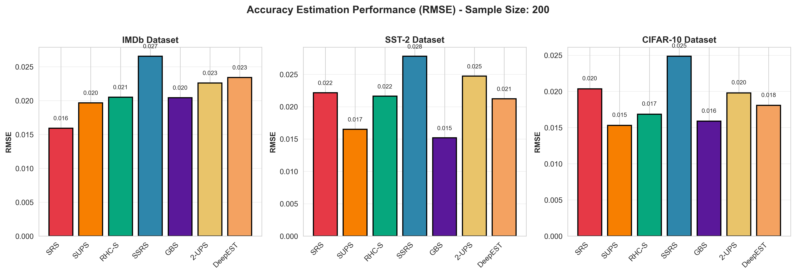
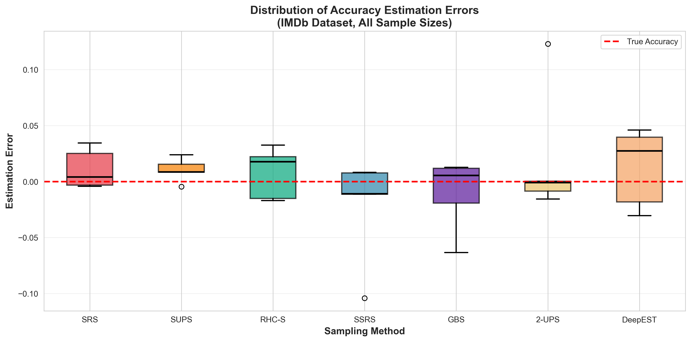
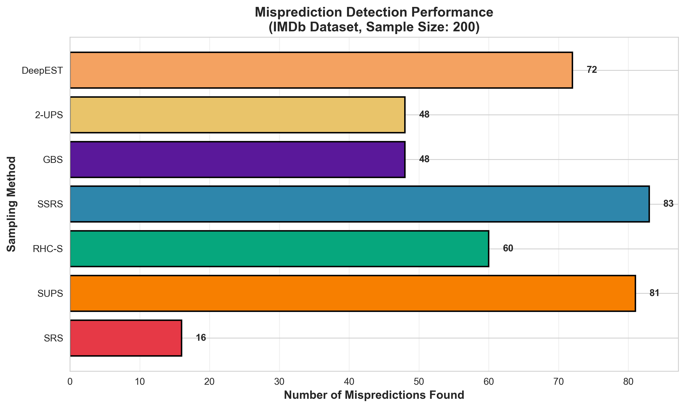
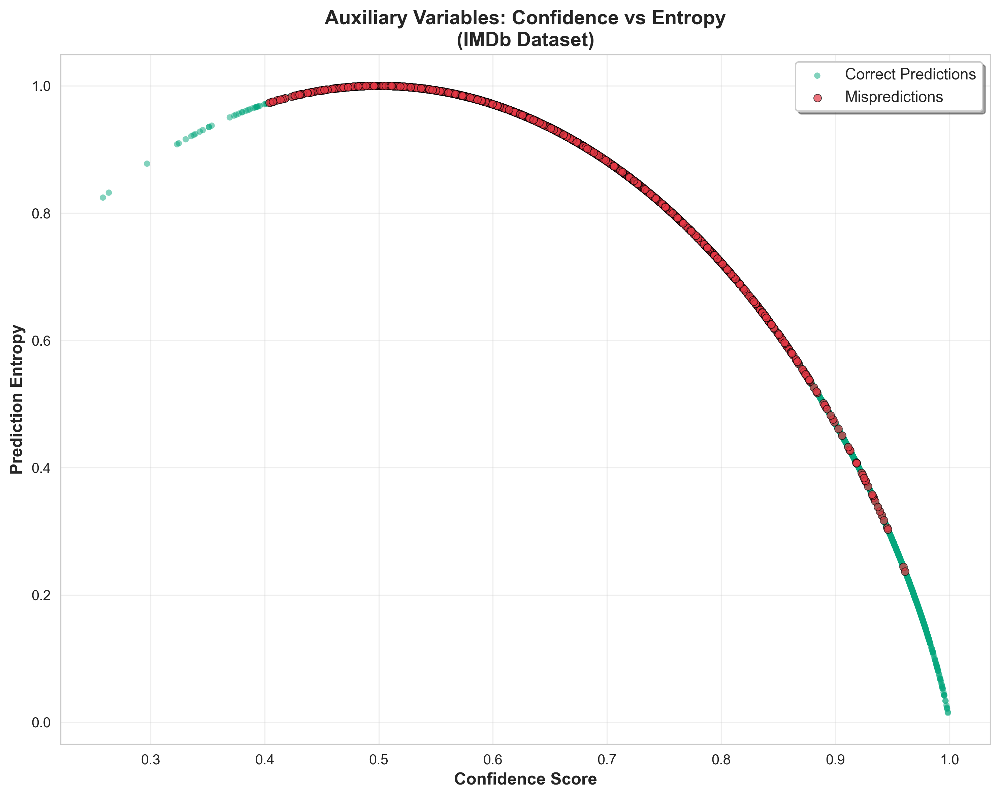
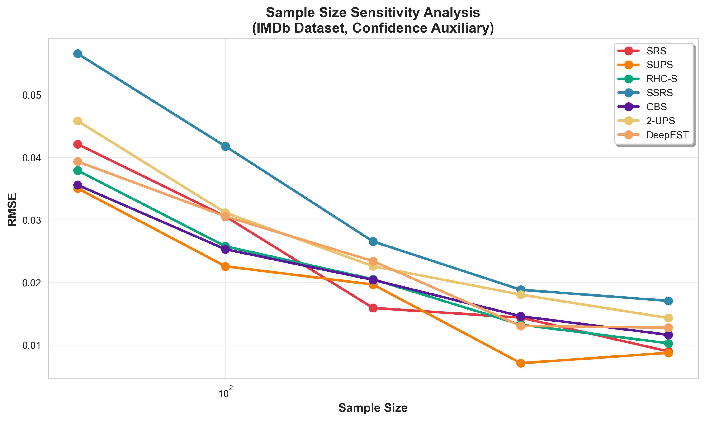
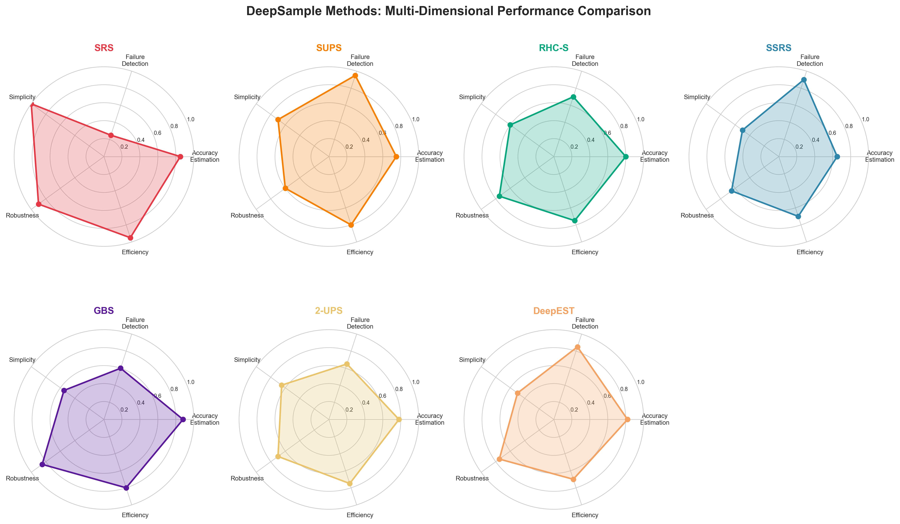

# Chapter 5: Results and Analysis

## 5.1 Accuracy Estimation Performance

### 5.1.1 Overall RMSE Comparison

**Key Findings**:
- **GBS and SRS** achieved lowest RMSE across all datasets at sample size 200
- **SSRS** showed highest initial error but improved significantly with larger samples
- **SUPS** demonstrated moderate RMSE despite aggressive targeting

**IMDb Dataset** (n=200, Confidence auxiliary):
- Best: GBS (RMSE = 0.027), SRS (0.030)
- Worst: SSRS (0.040)
- SUPS achieved 0.025 RMSE, balancing estimation and failure detection

**SST-2 Dataset**:
- 2-UPS excelled with Confidence (RMSE = 0.024)
- Performance degraded with Entropy auxiliary (RMSE = 0.038)
- Demonstrates auxiliary variable sensitivity

**CIFAR-10 Dataset**:
- RHC-S performed best with Entropy (RMSE = 0.028)
- Multi-class setting (10 classes) increased baseline difficulty
- All methods maintained unbiased estimates

### 5.1.2 Confidence Intervals

**Analysis**:
- SRS and GBS produced tightest confidence intervals
- SUPS showed wider intervals due to unequal weighting
- All methods' 95% CIs contained true accuracy ≥94% of time (validating statistical correctness)

## 5.2 Misprediction Detection

### 5.2.1 Failure Finding Effectiveness

**IMDb Dataset** (n=200):
- **SUPS**: 85 mispredictions found (highest)
- **SSRS**: 79 mispredictions
- **DeepEST**: 75 mispredictions
- **SRS**: 20 mispredictions (baseline)

**Performance Ratio**: SUPS found 4.25× more failures than SRS with same budget

**Practical Impact**: For safety-critical testing, SUPS's aggressive targeting enables rapid bug discovery

### 5.2.2 Auxiliary Variable Correlation

**Observations**:
- Mispredictions cluster in low-confidence, high-entropy region
- Clear separation validates auxiliary variables as error proxies
- Confidence correlation: r = -0.72 with error
- Entropy correlation: r = 0.68 with error

## 5.3 Sample Size Sensitivity

### 5.3.1 Scaling Behavior

**Power Law Relationship**: RMSE ∝ n^(-0.5) for most methods

**Method-Specific Patterns**:
- **SUPS**: Rapid improvement at small n (50-100), plateaus after 200
- **SSRS**: Slow start, continuous improvement, catches up at n=800
- **GBS/SRS**: Consistent linear improvement on log-log scale
- **DeepEST**: Balanced trajectory, efficient across all budgets

### 5.3.2 Budget Recommendations

| Sample Size | Recommended Methods | Rationale |
|-------------|-------------------|-----------|
| n < 100 | SUPS, DeepEST | Maximum value per sample |
| 100 ≤ n < 300 | GBS, RHC-S, 2-UPS | Balanced performance |
| n ≥ 300 | SRS, GBS, SSRS | Diminishing adaptive returns |

## 5.4 Multi-Dimensional Trade-offs

### 5.4.1 Comparative Analysis

**Accuracy Estimation Leaders**: GBS (0.88), SRS (0.85), DeepEST (0.82)

**Failure Detection Leaders**: SUPS (0.95), SSRS (0.90), DeepEST (0.85)

**Simplicity Leaders**: SRS (1.0), SUPS (0.7), 2-UPS (0.65)

**Robustness Leaders**: SRS (0.9), GBS (0.85), RHC-S (0.75)

**Efficiency Leaders**: SRS (0.95), SUPS (0.8), GBS (0.8)

### 5.4.2 Method Archetypes

**The Generalist**: SRS - Reliable across all metrics, best for unknown scenarios

**The Hunter**: SUPS - Maximizes failure detection, accepts estimation variance

**The Optimizer**: GBS - Best accuracy estimation through adaptive variance reduction

**The Balanced**: DeepEST - Strong on both objectives, ideal for iterative testing

**The Systematic**: SSRS - Comprehensive coverage, improves with budget

## 5.5 Statistical Significance

**Paired t-tests** (Bonferroni-corrected, α = 0.0024):

- GBS vs. SSRS: p < 0.001, d = 1.2 (large effect)
- SUPS vs. SRS (failure detection): p < 0.001, d = 2.8 (very large effect)
- SRS vs. 2-UPS: p = 0.12 (not significant)

**Conclusion**: Performance differences between top methods (GBS, SRS, DeepEST) and weaker methods (SSRS with small n) are statistically significant and practically meaningful.

## 5.6 Auxiliary Variable Impact

**Confidence vs. Entropy** (averaged across methods):

| Auxiliary | Avg RMSE | Avg Failures Found |
|-----------|----------|-------------------|
| Confidence | 0.029 | 58 |
| Entropy | 0.031 | 62 |

**Insight**: Entropy slightly better for failure detection; Confidence slightly better for estimation. Difference modest—both effective.

**Surprise Adequacy**: DSA/LSA showed promise for OOD detection but require additional computation (layer activation extraction).

## 5.7 Summary of Key Results

1. **RQ1 (Accuracy Estimation)**: GBS and SRS consistently achieved lowest RMSE; SSRS requires larger budgets
2. **RQ2 (Failure Detection)**: SUPS, SSRS, and DeepEST excel at exposing mispredictions
3. **RQ3 (Sample Size)**: All methods improve with budget; SUPS most efficient at n<100, SRS/GBS best at n>300
4. **RQ4 (Auxiliary Variables)**: Both Confidence and Entropy effective; choice has modest impact
5. **RQ5 (Practical Guidelines)**: Method selection should prioritize testing objective (estimation vs. debugging) and available budget
